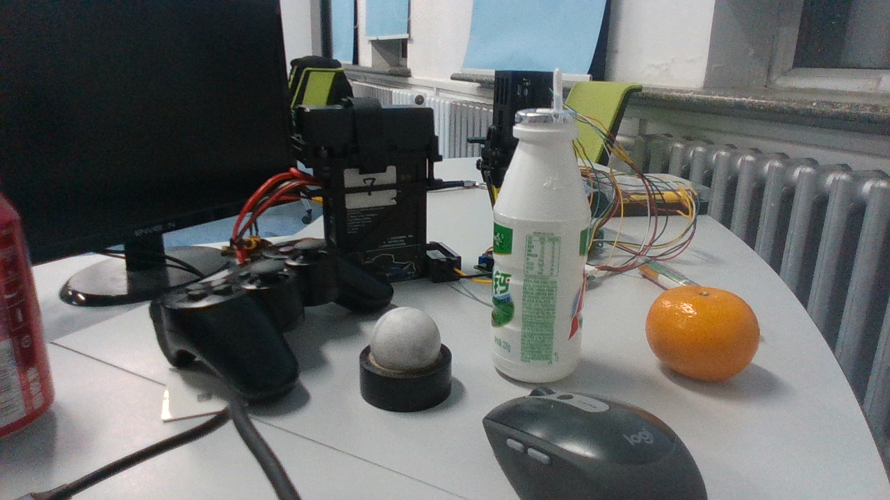
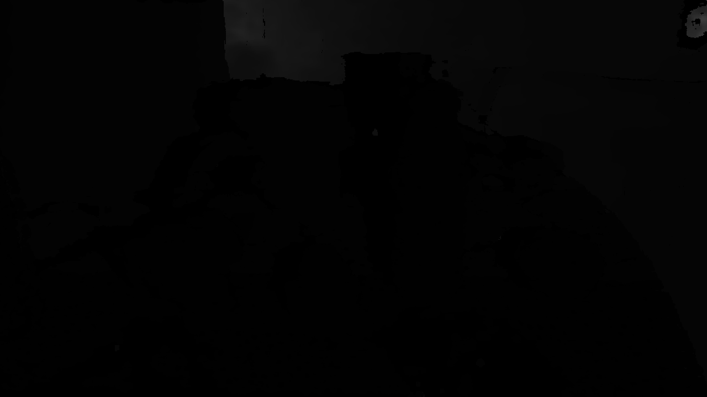

# 功能介绍

GraspNet（https://graspnet.net/） 是一个用于机器人抓取研究的大规模数据集和基准测试平台。它由清华大学的研究人员开发，旨在推动机器人抓取任务的研究与应用。

本项目是基于GraspNet的端侧推理节点, 根据置信度大小降序排序, 输出用于下游机械臂抓取的GraspGroup信息。目前无做输出结果数量和置信度阈值限制。

| 彩色图            | 深度图 |
| ------------------ | -------- | 
|   |  | 

算法输出的数据结构GraspGroup：
```c++
class GraspGroup {
  float score;
  float width;
  float height;
  float depth;
  std::vector<float> rotation;
  std::vector<float> translation;
  int object_id;
}
```

# 开发环境

- 编程语言: python
- 开发平台: X5
- 系统版本：Ubuntu 22.04

# 编译

- X5版本：支持在X5 Ubuntu系统上编译和在PC上使用docker交叉编译两种方式。

## 依赖库

ros package：

- sensor_msgs
- ai_msgs

## X5 Ubuntu系统上编译

1、编译环境确认

- 板端已安装X5 Ubuntu系统。
- 当前编译终端已设置TogetherROS环境变量：`source PATH/setup.bash`。其中PATH为TogetherROS的安装路径。
- 已安装ROS2编译工具colcon。安装的ROS不包含编译工具colcon，需要手动安装colcon。colcon安装命令：`pip install -U colcon-common-extensions`
- 已编译dnn node package

2、编译

- 编译命令：`colcon build --packages-select object_graspnet`

## docker交叉编译 X5 版本

1、编译环境确认

- 在docker中编译，并且docker中已经安装好TogetherROS。docker安装、交叉编译说明、TogetherROS编译和部署说明详见机器人开发平台robot_dev_config repo中的README.md。
- 已编译 object_graspnet package
- 已编译 hbm_img_msgs package（编译方法见Dependency部分）

2、编译

- 编译命令：

  ```shell
  # RDK X5
  bash robot_dev_config/build.sh -p X5 -s object_graspnet

## 注意事项

# 使用介绍

## 参数

| 参数名             | 解释                                  | 是否必须             | 默认值              | 备注                                                                    |
| ------------------ | ------------------------------------- | -------------------- | ------------------- | ----------------------------------------------------------------------- |
| feed_type          | 图片来源，False：本地；True：订阅            | 否                   | False                   |
| image              | 本地深度图片地址                          | 否                   | config/depth.png     |
| is_collision_detect  | 是否打开碰撞检测        | 否                   | 0                   | 
| model_file_name        | 模型文件            | 否 | config/graspnet_test.bin                   |
| num_points         | 采样点云数             | 否                   | 8000                   | 
| ai_msg_pub_topic_name         | 智能消息发布话题信息             | 否                   | /hobot_object_graspgroup                   | 
| ros_img_sub_topic_name         | 深度图订阅话题信息            | 否                   | /camera/depth/image_raw                   | 


## 运行

## X5 Ubuntu系统上运行

运行方式1，使用可执行文件启动：
```shell
export COLCON_CURRENT_PREFIX=./install
source /opt/ros/humble/setup.bash
source ./install/local_setup.bash
# config中为示例使用的模型，回灌使用的本地图片
cp -r install/object_graspnet/lib/object_graspnet/config/ .

# 运行模式1：使用本地png格式深度图通过同步模式进行回灌预测
ros2 run object_graspnet object_graspnet_node --ros-args -p feed_type:=False -p image:=config/depth.png

# 运行模式2：使用订阅到的image msg(topic为/camera/depth/image_raw )通过异步模式进行预测，并设置log级别为warn
ros2 run object_graspnet object_graspnet_node --ros-args -p feed_type:=True --ros-args --log-level warn
```

## X5 buildroot系统上运行

```shell
export ROS_LOG_DIR=/userdata/
export LD_LIBRARY_PATH=${LD_LIBRARY_PATH}:./install/lib/

# config中为示例使用的模型，回灌使用的本地图片
cp -r install/lib/object_graspnet/config/ .

# 运行模式1：使用本地png格式深度图通过同步模式进行回灌预测
./install/lib/object_graspnet/object_graspnet_node --ros-args -p  feed_type:=False -p image:=config/depth.png

# 运行模式2：使用订阅到的image msg(topic为/camera/depth/image_raw )通过异步模式进行预测，并设置log级别为warn
./install/lib/object_graspnet/object_graspnet_node --ros-args -p feed_type:=True --log-level warn

```

## 注意事项

- cam_info.json配置文件格式为json格式，存储相机参数信息，具体配置如下：

```json
  {
    "height": 720,
    "width": 1280,
    "fx": 637.91,
    "fy": 637.91,
    "cx": 639.65,
    "cy": 391.311,
    "scale": 1000.0
  }
```
# 结果分析

## X5结果展示

log：

运行命令：`ros2 run object_graspnet object_graspnet_node --ros-args -p feed_type:=0 -p image:=config/depth.png`

```shell
[WARN] [0000043791.064331506] [object_graspnet_node]: Object Graspnet Node has been started.
[INFO] [0000043796.023847050] [object_graspnet_node]: parser num : 512, postprocess num: 512.
[WARN] [0000043796.298699508] [object_graspnet_node]: preprocess time: 0.322 s, inference time: 3.391 s, parser time: 0.008 s, collision detect time: 0.004 s.
feedback result:
 Grasp: score:2.721024751663208, width:0.0, height:0.019999999552965164, depth:0.03999999910593033, translation:[-0.72933614 -2.5657558   5.432     ]
rotation:
[[ 0.53137714 -0.84245545 -0.08892141]
 [-0.1695238  -0.00290471 -0.98552173]
 [ 0.83        0.538758   -0.14435975]]
object id:-1
[INFO] [0000043796.373340966] [object_graspnet_node]: feedback finshed!
```
